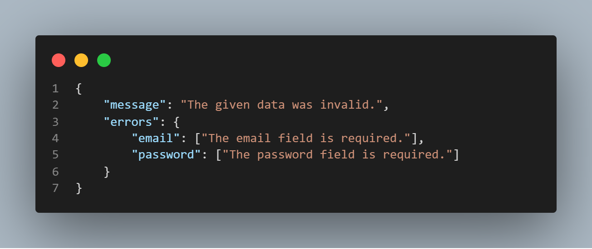
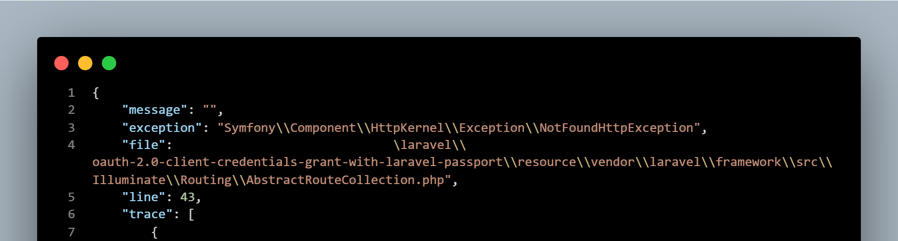
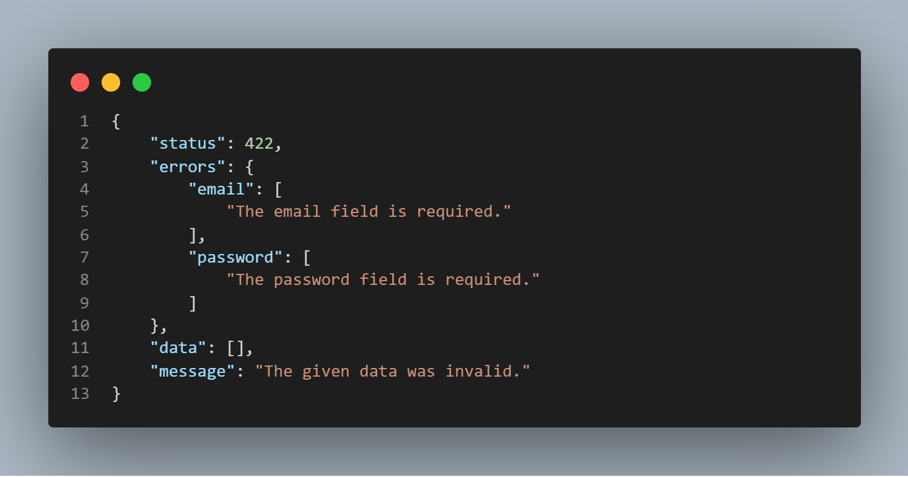
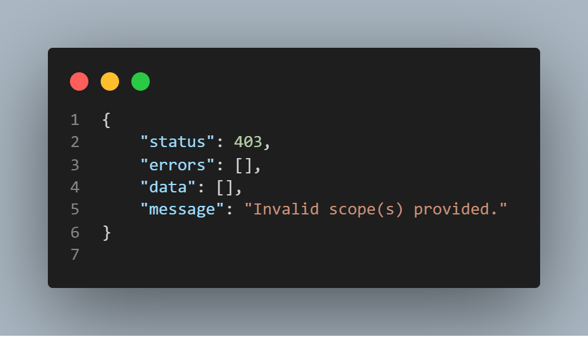
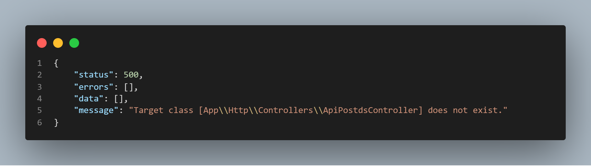

<p align="center"></p>

### THE CHALLANGE I HAD

While building APIs with Laravel for my Front End apps, I wanted uniformity with how response from my backend is served -whether as a result of an error from the server, a custom error I generated based on user interactions, or a response to a successful operation. I wanted the front end apps to always expect a response in a certain pattern, no matter the case. 

### WHAT I FOUND
Laravel has different ways it returns error messages. The one I love most has to be the way it returns it's 422 (Unprocessable Entity). An object is returned with a message and an errors key. Attached to the errors key is another object with each key in it pointing to the field with the error, and an array of all the errors for that field as property of the key. 



### THE DIFFERENCE
In the case of a 404 error, the error display is quite different. An object is returned, with a message key that is empty but no errors key. In place of that, you get an exception key with a NotFoundHttpException value. 



It's almost similar with a 500 server error and others. But in a 401 unauthorized exception, you get an object with a message key and a property that reads "unauthenticated".

For most use cases, this is okay but I just wasn't cool with it. I know the normal thing to do in your front end apps is to simply check for the status codes for each request and handle appropriately, but I just didn't want it that way. 

I wanted a pattern, uniformity. I wanted an object that contains the same keys no matter the error or success type.

### MY LITTLE FIX
The Use of a Custom Trait to intercept whatever error was being handled, reformat them and to the front end with the style and pattern I want.

### HOW TO USE
1. Clone the repo
2. Copy the folder called "Traits" and paste in your app directory
3. Navigate to your Exceptions directory and open the Handler.php class
4. To import the class namespace, add to the top of the class 
   ``` 
    use App\Traits\JsonExceptionInterceptor; 
    ```
5. And within the class, just before declaring any method, paste
   ``` 
    use JsonExceptionInterceptor;
   ```
6. To allow the Handler run the code from the trait, delete everything within the render method and paste
   ``` 
        if($request->expectsJson()) { 
           return $this->reformatJsonExceptionMessage($exception);
        }  
        return parent::render($request, $exception); 
    ```

    That's all. I was just checking to see if a request expects a response in JSON and if true, reformat the exception messages. 

### WHAT YOU SHOULD SEE
The same error messages that you've always seen from laravel whenever an exception is raised. But this time, you should always expect them in an arranged format, in an object with these keys and properties: 
```
    {
        "message": (string) The error message (if any),
        "status": (int) The response status,
        "errors": (object) The errors that you are trying to return
        "data": (array) [] An return of data from the server. Mostly used if request is sucessful,
    }
```

If it's a custom error, (one you raised yourself), in your controller for example, you can also follow this approach. You can create a method in your base controller and let it be responsible for returning JSON responses using this format. 

#### A 422 error will now be something like this


#### A 403 error will be something like this


#### A 500 error will be something like this


### THE PURPOSE
Uniformity. My Front End app can always be sure of getting a response with these keys and properties. So no matter the use case, it checks the status and automatically displays errors if the contents of the errors key is not empty. 

#### LINE TRACE
If you wish to see the file, line and trace of the exception as shown by Laravel, mainly for debugging, make sure to turn debug on in your env file and they should also included in the response.

### SUPPORT 
Laravel ^5.6.* >= 8.*.*


### LICENSE
MIT License